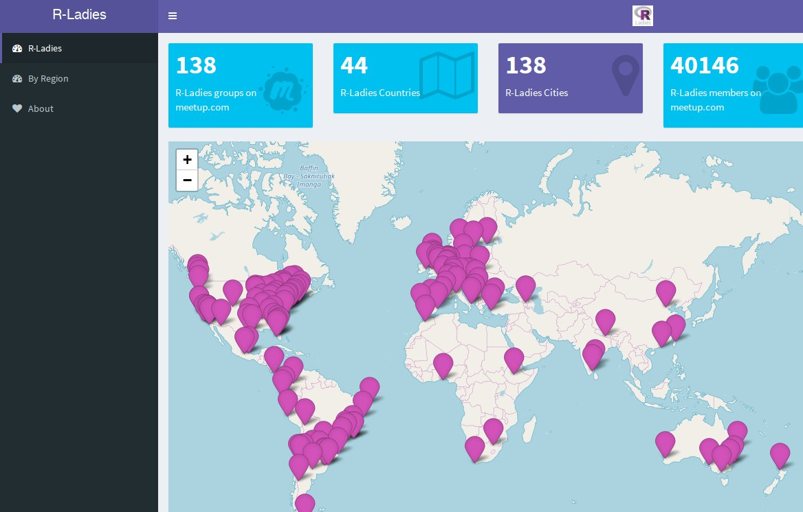

```{r setup, include=FALSE}
options(htmltools.dir.version = FALSE)
```

class: inverse, center, middle

# Keep in touch

<a href="mailto:mireia@rladies.org"><i class="fa fa-paper-plane fa-fw"></i>&nbsp; mireia@rladies.org</a><br>
<!-- <a href="https://apreshill.rbind.io"><i class="fa fa-link fa-fw"></i>&nbsp; apreshill.rbind.io</a><br> -->
<a href="http://twitter.com/mireia_bioinfo"><i class="fa fa-twitter fa-fw"></i>&nbsp; @mireia_bioinfo</a><br>
<a href="http://github.com/mirthelle"><i class="fa fa-github fa-fw"></i>&nbsp; @mirthelle</a><br>
<a href="http://cslu.ohsu.edu"><i class="fa fa-map-marker fa-fw"></i>&nbsp; Endocrine Regulatory Genomics (IGTP, Badalona)</a>

---

# `whoami`

.pull-left[
* BSc in Biomedicine; MSc in Bioinformatics.
* Working on my PhD (4th year!!! `r icon::fa("skull")`)
* Interested in genomics and epigenomics, but mostly programming!
* `#rcatlady` 

]

.pull-right[

]

---

background-image: url("https://media.giphy.com/media/10ZkZlv7XYbNF6/giphy.gif")
background-position: 50% 50%
class: center, inverse

# What is R-Ladies?

---

# Mission

### R-Ladies is a worldwide organization whose mission is to promote gender diversity in the R community.

.pull-left[

* Supporting minority gender R enthusiats achieve programming potential.

* Building a collaborative global network of R leaders, mentors, learners and developers.

* Encouraging, inspiring and empowering.

* Creating safe space for all us!
]

.pull-right[

]

---

# How?

.pull-left[
* Community

* Conversation

* Instruction

* Teaching experience

* Speaking experience

* Networking

* Mentorship

* Friendship
]
.pull-right[

]

---

# Event formats

* Workshops on R packages/features.
    * Jupyter notebooks with R (2017-11-6).
    * `ggplot2`: Plots with ggplot2 are better plots (2017-09-27).
    * `Rmarkdown`: RMarkdown tutorial and bioinformatics talk (2017-01-16).
    * `dplyr` and `tidyr`: Data wrangling with dplyr and tidyr (2017-03-20).
    
* General talks:
    * Bioinformatics with R (2017-06-12).
    * Scalable Machine Learning in R and Python with H2O (2016-12-5).

* Fast talks:
    * Genome exploration with Shiny (Today!).
    
* Other ideas:
    * Book club.
    * `#tidytuesday`.
    * ????

---

# Where?

--


[https://gqueiroz.shinyapps.io/rshinylady/](https://gqueiroz.shinyapps.io/rshinylady/)

---

# Get **xaringan**

Install the **xaringan** package from [Github](https://github.com/yihui/xaringan):

```{r eval=FALSE, tidy=FALSE}
devtools::install_github("yihui/xaringan")
```

--

You are recommended to use the [RStudio IDE](https://www.rstudio.com/products/rstudio/), but you do not have to.

- Create a new R Markdown document from the menu `File -> New File -> R Markdown -> From Template -> Ninja Presentation`;

--

- Click the `Knit` button to compile it;

--

- or use the [RStudio Addin](https://rstudio.github.io/rstudioaddins/)<sup>1</sup> "Infinite Moon Reader" to live preview the slides (every time you update and save the Rmd document, the slides will be automatically reloaded in RStudio Viewer.

.footnote[
[1] See [#2](https://github.com/yihui/xaringan/issues/2) if you do not see the template or addin in RStudio.
]


---
background-image: url("https://media.giphy.com/media/q1zsIXcp8N2ne/giphy.gif")
background-position: 50% 50%
class: center, inverse


# Use a theme

---

# Themes

You can use some user-contributed themes. A theme typically consists of two CSS files `foo.css` and `foo-fonts.css`, where `foo` is the theme name. Below are some existing themes:

```{r}
names(xaringan:::list_css())
```

To use a theme, you can specify the `css` option as an array of CSS filenames (without the `.css` extensions), e.g.,

```yaml
output:
  xaringan::moon_reader:
    css: [default, metropolis, metropolis-fonts]
```

If you want to contribute a theme to **xaringan**, please read [this blog post](https://yihui.name/en/2017/10/xaringan-themes).


---

# The R-Ladies theme

You can use it in the YAML metadata, e.g.:

```yaml
---
title: "A Cool R-Ladies Presentation"
output:
  xaringan::moon_reader
    css: ["default", "rladies", "rladies-fonts"]
    nature:
          highlightLines: true
---
```

See the help page `?xaringan::moon_reader` for all possible options that you can use. 

💜 Definitely use the `highlightLines: true` option- read on to see why! 

---
background-image: url("https://media.giphy.com/media/UqjSzv18agbgk/giphy.gif")
background-position: 50% 50%
class: center, inverse


# Now we can really have fun!

---

# Side by side slides


.pull-left[

]

.pull-right[

]


---

# Math Expressions

You can write LaTeX math expressions inside a pair of dollar signs, e.g. &#36;\alpha+\beta$ renders $\alpha+\beta$. You can use the display style with double dollar signs:

```
$$\bar{X}=\frac{1}{n}\sum_{i=1}^nX_i$$
```

$$\bar{X}=\frac{1}{n}\sum_{i=1}^nX_i$$

Limitations:

1. The source code of a LaTeX math expression must be in one line, unless it is inside a pair of double dollar signs, in which case the starting `$$` must appear in the very beginning of a line, followed immediately by a non-space character, and the ending `$$` must be at the end of a line, led by a non-space character;

1. There should not be spaces after the opening `$` or before the closing `$`.

1. Math does not work on the title slide (see [#61](https://github.com/yihui/xaringan/issues/61) for a workaround).

---

# R Code

```{r comment='#'}
# a boring regression
fit = lm(dist ~ 1 + speed, data = cars)
coef(summary(fit))
```

---

# R Plots

```{r cars, fig.height=4, dev='svg'}
library(ggplot2)
ggplot(cars, aes(speed, dist)) + geom_point()
```

---

# Tables

If you want to generate a table, make sure it is in the HTML format (instead of Markdown or other formats), e.g.,

```{r}
knitr::kable(head(iris), format = 'html')
```

---

# Highlight code

- The option `highlightLines: true` of `nature` will highlight code lines that start with `*` or are wrapped in `{{ }}`;

    ```yaml
    output:
      xaringan::moon_reader:
        nature:
          highlightLines: true
    ```

    See examples on the next page.

---

# Highlight code


.pull-left[
An example using a leading `*`:

    ```r
    if (TRUE) {
    ** message("Very important!")
    }
    ```
Output:
```r
if (TRUE) {
* message("Very important!")
}
```

This is invalid R code, so it is a plain fenced code block that is not executed.
]

.pull-right[
An example using `{{}}`:

    `r ''````{r tidy=FALSE}
    if (TRUE) {
    *{{ message("Very important!") }}
    }
    ```
Output:
```{r tidy=FALSE}
if (TRUE) {
{{ message("Very important!") }}
}
```

It is valid R code so you can run it.
]


---

class: center, middle

# Thanks!

Slides created via the R package [**xaringan**](https://github.com/yihui/xaringan).

